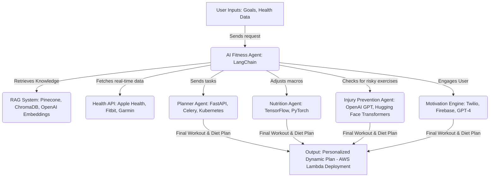

---

# AI-Powered Fitness Assistant - LLM Agent Use Case
_A Dynamic AI Coaching System for Personalized Workouts & Nutrition_

## 📌 Problem Statement
Traditional fitness plans **do not adapt** to real-time user needs. Users struggle with:
- **Lack of personalized workouts** based on fitness level & health conditions.
- **Static nutrition plans** that do not change based on real-world progress.
- **Low motivation** and **lack of engagement**.

## ✅ Solution: AI-Powered Fitness Assistant
A **Conversational AI Agent** that:
- **Dynamically adjusts workouts & diet** based on real-time **biometric data**.
- **Engages users with motivation strategies** to prevent drop-off.
- **Prevents injuries** by adapting exercises **based on health conditions**.

---

## 🔹 RAG vs. AI Agents: Key Differences

| Feature                | RAG (Retrieval-Augmented Generation)  | AI Agents (Multi-Agent System)  |
|------------------------|--------------------------------------|---------------------------------|
| **Core Functionality**  | Fetches & augments information  | Takes **actions & decisions** autonomously |
| **Data Source**  | Vector Databases (Pinecone, ChromaDB)  | APIs, User Feedback, Memory Storage |
| **Decision Making** | LLM only retrieves **relevant info** | AI Agent **analyzes & executes** decisions |
| **Use Case**  | **FAQ, Chatbots, Research Assistants** | **Personal Assistants, AI Coaching, Task Automation** |

---

## 🔹 AI-Powered Fitness Assistant: **System Architecture**

### **Step-by-Step Breakdown**
1️⃣ **User Inputs Fitness Goals & Preferences**  
   - Example: "I want to lose weight, but I have knee pain."  

2️⃣ **AI Agent Orchestrates Task Execution**  
   - **RAG System**: Fetches best workout & nutrition data.  
   - **Health API**: Tracks real-time biometrics (Fitbit, Apple Health).  

3️⃣ **AI Agents Execute Specialized Functions**  
   - **Planner Agent**: Designs weekly workout plan.  
   - **Nutrition Agent**: Adjusts diet based on calories burned & muscle gain.  
   - **Injury Prevention Agent**: Ensures safe exercises based on injury risks.  
   - **Motivation Engine**: Detects user inactivity & sends motivational prompts.  

4️⃣ **Final Plan is Continuously Updated**  
   - **Dynamically adjusts recommendations** as user progresses.

## 🔹 Example Freeletics Use Case: AI in Action

**📌 Scenario:**  
**💪 User**: "I want to improve endurance but have knee pain."  
**🤖 AI Agent**: Fetches safe workouts (low-impact cardio).  
**📊 Health API**: Tracks user performance & adjusts difficulty.  
**🍽️ Nutrition Agent**: Recommends higher protein intake for recovery.  
**⚠️ Injury Agent**: Removes high-risk plyometric exercises.  
**🎯 Output**: A **personalized, evolving fitness plan**.

---

## 🔹 Business Benefits of AI Fitness Agents
✔️ **Real-time adaptation** of workouts & diet plans.  
✔️ **AI-driven coaching increases engagement** & retention.  
✔️ **Injury prevention through intelligent tracking.**  
✔️ **Scalable, enterprise-ready AI coaching system.**  

🚀 **This AI agent-driven model is ideal for Freeletics to enhance AI-powered coaching!**
