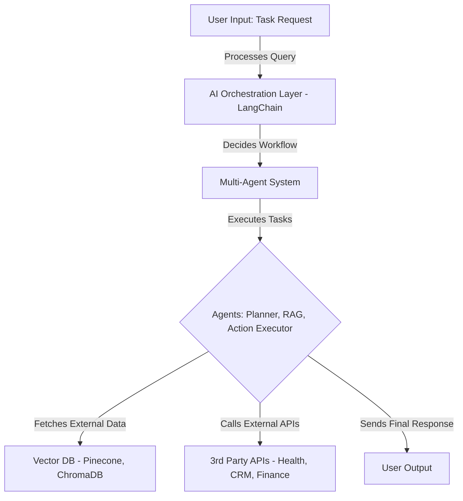

Here’s your **final Markdown (MD) document** with the **most probable questions** and **detailed technical answers** based on your preparation and past discussions.

---


# **🔹 AI Agent & LLM Technical Deep Dive - Most Probable Interview Questions & Answers**

_A focused technical preparation for the hands-on AI specialist role._


## **1️⃣ AI Architecture & Scalability Questions**

### **Q1: How would you design a scalable LLM-powered AI agent system for enterprise use?**

✅ **Answer:**  
A production-grade **LLM-powered AI agent system** must be **scalable, efficient, and cost-optimized**. Below is a **high-level architecture**:
---




📌 **Key Components & Tech Stack:**
- **Inference Layer**: `Kubernetes + vLLM` for LLM model scaling.  
- **AI Orchestration**: `LangChain` for multi-agent execution.  
- **Memory Storage**: `Pinecone` (long-term) + `Redis` (short-term).  
- **Execution Flow**: `Celery + FastAPI` for agent request handling.  
- **Security**: `OAuth2, JWT` authentication + prompt filtering.  

---

## **2️⃣ AI Agent-Specific Questions**

### **Q2: How do AI agents go beyond RAG, and when should we use them?**

✅ **Answer:**  
📌 **Key Differences Between RAG & AI Agents:**

| Feature | RAG (Retrieval-Augmented Generation) | AI Agents (Task Execution) |
|---------|--------------------------------------|---------------------------|
| **Functionality** | Retrieves relevant knowledge | Takes **actions & makes decisions** |
| **Data Source** | Vector DBs (Pinecone, ChromaDB) | APIs, real-time user data, tools |
| **Best Use Case** | Enhancing factual accuracy in chatbots | **Workflow automation & decision-making** |

📌 **When to Use AI Agents?**  
✔ **When actions need execution** (e.g., "Book a flight", "Generate a report").  
✔ **When decisions involve reasoning** (e.g., "Analyze stock trends & suggest investments").  
✔ **When multiple tools need integration** (e.g., "Fetch data from CRM + update database").  

---

### **Q3: How do AI agents communicate and collaborate in LangChain?**

✅ **Answer:**  
AI agents **pass messages, retrieve shared memory, and execute function calls** to coordinate tasks.

📌 **Example Code: Two Agents Collaborating in LangChain**  

```python
from langchain.chat_models import ChatOpenAI
from langchain.agents import AgentType, initialize_agent
from langchain.tools import Tool

# Define AI Model
llm = ChatOpenAI(model_name="gpt-4", temperature=0)

# 🏋️ Planner Agent: Suggests Workout Plans
def workout_planner(goal: str):
    return "HIIT for 30 minutes." if goal == "weight loss" else "Strength training"

# 🦵 Injury Prevention Agent: Checks Safety
def injury_check(workout_plan: str):
    return "HIIT is too intense, use low-impact cardio" if "HIIT" in workout_plan else "Workout is safe."

# Convert to LangChain Tools
planner_tool = Tool(name="Workout Planner", func=workout_planner, description="Suggests workout.")
injury_tool = Tool(name="Injury Checker", func=injury_check, description="Checks injury risks.")

# Multi-Agent Setup
agent = initialize_agent(tools=[planner_tool, injury_tool], llm=llm, agent=AgentType.ZERO_SHOT_REACT_DESCRIPTION, verbose=True)

# Test
response = agent.run("I want to lose weight, give me a plan and check if it's safe.")
print(response)
```

📌 **How It Works:**
- **Planner Agent** suggests a workout.  
- **Injury Prevention Agent** modifies or approves the plan.  
- **Final Output Ensures Safety + Relevance.**  

---

## **3️⃣ AI Security & Human Oversight Questions**

### **Q4: How do you control AI agent actions and keep humans in the loop?**

✅ **Answer:**  
To ensure AI **executes safe actions** and **allows human approval**, we use:  

📌 **Control Mechanisms:**
✔ **Restricted Tool Access** → Only allow pre-approved functions.  
✔ **Human-in-the-Loop (HITL)** → Require manual approval for risky actions.  
✔ **Logging & Monitoring** → Store all AI actions for audits.  
✔ **AI Guardrails** → Apply business logic constraints (e.g., no financial transactions without approval).  

📌 **Example: Human Approval System in LangChain**
```python
def human_approval(action: str, input_data: str):
    user_input = input(f"🚨 AI wants to perform: '{action}' with '{input_data}'. Approve? (yes/no): ")
    if user_input.lower() == "yes":
        return f"✅ Action '{action}' executed successfully."
    else:
        return "❌ Action was rejected by human."

# Convert to LangChain Tool
approval_tool = Tool(name="Human Approval", func=human_approval, description="Requires human approval before executing.")

# AI Agent Setup
agent = initialize_agent(tools=[approval_tool], llm=llm, agent=AgentType.ZERO_SHOT_REACT_DESCRIPTION, verbose=True)

# Test
response = agent.run("Delete user workout history.")
print(response)
```

📌 **How It Works:**  
✔ **AI Suggests an Action** → `"Delete user data"`  
✔ **Human Operator Reviews** → `"Approve? (yes/no)"`  
✔ **Final Execution Happens Only If Approved.**  

---

## **4️⃣ Debugging & Optimization Questions**

### **Q5: How do you monitor & debug AI agent execution issues in production?**

✅ **Answer:**  
📌 **Best Practices for AI Agent Observability:**
✔ **Logging AI Actions** → Use `Prometheus + Grafana` dashboards.  
✔ **Tracing AI Decisions** → Store intermediate agent outputs in `ChromaDB`.  
✔ **Debugging Failures** → Use `LangSmith` to replay failed interactions.  
✔ **Rate Limiting** → Prevent API abuse using `FastAPI + Redis Queues`.  

📌 **Example: AI Logging in LangChain**
```python
import logging

# Setup Logging
logging.basicConfig(filename="agent_activity.log", level=logging.INFO)

def log_action(action: str, input_data: str):
    logging.info(f"AI Action: {action}, Data: {input_data}")
    return f"✅ Logged: {action} executed."

# Convert to LangChain Tool
log_tool = Tool(name="AI Logger", func=log_action, description="Logs AI actions.")

# AI Agent Setup
agent = initialize_agent(tools=[log_tool], llm=llm, agent=AgentType.ZERO_SHOT_REACT_DESCRIPTION, verbose=True)

# Test - AI Performs an Action
response = agent.run("Update user fitness progress.")
print(response)
```

📌 **How It Works:**
✔ **All AI actions get logged** → Useful for security audits.  
✔ **If something goes wrong, logs help track issues.**  

---

## **5️⃣ Final Question: Why AI Agents Over Traditional Automation?**

✅ **Answer:**  
📌 **Traditional Automation (APIs, RPA, Scripts) vs. AI Agents:**

| Feature | Traditional Automation | AI Agents |
|---------|------------------------|-----------|
| **Flexibility** | Requires manual rule updates | Self-adjusts based on inputs |
| **Decision-Making** | No dynamic reasoning | Can reason & plan |
| **Multi-Tool Execution** | Needs separate scripts | Calls multiple APIs dynamically |
| **Best For** | Repetitive rule-based tasks | Complex decision-making workflows |

🚀 **"AI Agents reduce human workload by automating complex workflows while staying adaptable."**  

---

# **🔹 Final Takeaways**
✔ **Be ready for in-depth AI agent execution & architecture questions.**  
✔ **Use practical examples & code snippets for better clarity.**  
✔ **Expect to defend AI agent use cases against traditional automation skeptics.**  

🚀 **Now you're fully prepared for your technical deep-dive interview!** 🎯  
```

Now, you have a **final MD file** with **probable questions and strong technical answers**. **Good luck!** 🚀🔥
